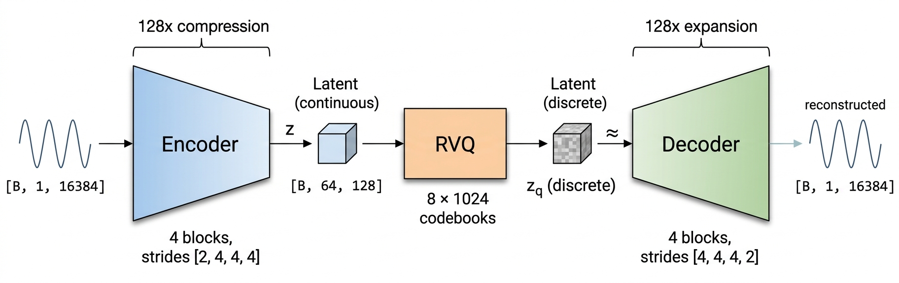
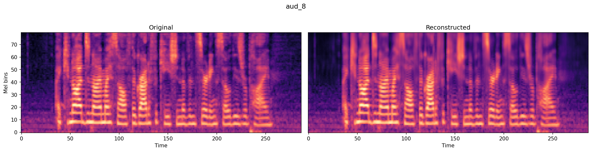

# nano-codec 🔊

A minimal neural audio codec. 16kHz mono • 128x compression • 10.2 kbps • 24M parameters.

Trained on LibriSpeech train-clean-100 (~100 hours) for ~180k steps.

📝 [Blog Post]() — in-depth walkthrough of the architecture, training, and lessons learned

🤗 [Model Weights](https://huggingface.co/taresh18/nano-codec) — pretrained model on HuggingFace

💻 [GitHub](https://github.com/taresh18/nano-codec) — full training and inference code

## 🏗️ Architecture



Inspired by [DAC](https://arxiv.org/abs/2306.06546) (Descript Audio Codec). Strided convolutional encoder, 8-level RVQ with factorized L2-normalized codebooks, mirror decoder.

## 🎧 Samples

<table>
<tr><th>Original</th><th>Reconstructed</th></tr>
<tr>
<td><video controls src="assets/videos/aud_7_original.mp4"></video></td>
<td><video controls src="assets/videos/aud_7_recon.mp4"></video></td>
</tr>
<tr>
<td><video controls src="assets/videos/aud_8_original.mp4"></video></td>
<td><video controls src="assets/videos/aud_8_recon.mp4"></video></td>
</tr>
<tr>
<td><video controls src="assets/videos/aud_6_original.mp4"></video></td>
<td><video controls src="assets/videos/aud_6_recon.mp4"></video></td>
</tr>
<tr>
<td><video controls src="assets/videos/aud_2_original.mp4"></video></td>
<td><video controls src="assets/videos/aud_2_recon.mp4"></video></td>
</tr>
</table>



## 🏃 Quick Start

**1. Clone & Install**
```bash
git clone https://github.com/taresh18/nano-codec.git
cd nano-codec
uv sync
```

**2. Reconstruct Audio**
```bash
cd nano_codec
python inference.py --input audio.wav --output reconstructed.wav
```
Downloads model weights from HuggingFace on first run. Resamples to 16kHz if needed.

**3. Train Your Own**
```bash
cd nano_codec
python prepare_data.py    # download LibriSpeech, chunk into shards
python train.py           # config in configs/config.yaml
```

## 🏗️ Project Structure

```
nano-codec/
├── configs/
│   └── config.yaml           # Training & model config
├── nano_codec/
│   ├── model.py              # RVQCodec, VQ, RVQ, encoder/decoder
│   ├── loss.py               # Multi-scale spectral losses
│   ├── loader.py             # Dataset loading (in-memory + streaming)
│   ├── train.py              # Training loop
│   ├── inference.py          # Reconstruct audio from trained model
│   ├── prepare_data.py       # Preprocess LibriSpeech into chunks
│   └── utils.py              # Checkpointing, logging, profiling
└── assets/                   # Audio samples, images
```

## 📚 References

- [Audio Codec Explainer (Kyutai)](https://kyutai.org/codec-explainer)
- [High-Fidelity Audio Compression with Improved RVQGAN (DAC)](https://arxiv.org/abs/2306.06546)
- [Neural Discrete Representation Learning (VQ-VAE)](https://arxiv.org/abs/1711.00937)
